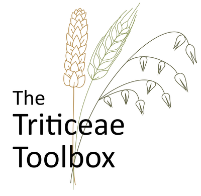

# T3/Breedbase Docker Image

<p float="left">
  
  
</p>

This repo contains the Dockerfile for building the T3 version of [breedbase](https://breedbase.org).  This repository is a fork of the the [original Breedbase Dockerfile](https://github.com/solgenomics/breedbase_dockerfile).  T3 will periodically update this image and it is available for download on Docker Hub as [triticeaetoolbox/breedbase_web](https://hub.docker.com/r/triticeaetoolbox/breedbase_web).

**If you are looking run a prebuilt T3/Breedbase image**, follow the instructions in the [TriticeaeToolbox/breedbase](https://github.com/TriticeaeToolbox/breedbase) repository.  This repo includes instructions on how to set up your Docker host along with helper scripts to setup the intial Breedbase instance(s) and update them when a new image is released.

The main differences between this T3 version of Breedbase and the original Breedbase image include:

- the use of the [T3 sgn repo](https://github.com/TriticeaeToolbox/sgn) (main codebase for breedbase)
    - the T3 version includes some T3-specific changes and features
- pre-loaded trait ontologies for wheat, oat, and barley
- can be used in conjunction with the [TriticeaeToolbox/breedbase](https://github.com/TriticeaeToolbox/breedbase) repository for the Docker host setup and helper scripts

## Build Instructions

### Update Repositories

Before building the new Docker image, make sure the `t3/master` branch of the `TriticeaeToolbox/sgn` repo and all of the instance branches (`triticum`, `triticum-sandbox`, `avena`, etc) of the `TriticeaeToolbox/mason` repo are updated with the latest changes that are to be included in the new Docker image build.

For example, to update the `t3/master` branch of the `TriticeaeToolbox/sgn` repo with changes from the upstream `solgenomics/sgn` repo using a specific tag:

```bash
djw64:sgn ● t3/master:✓ $ git remote -v
origin  git@github.com:TriticeaeToolbox/sgn.git (fetch)
origin  git@github.com:TriticeaeToolbox/sgn.git (push)
sgn     git@github.com:solgenomics/sgn.git (fetch)
sgn     git@github.com:solgenomics/sgn.git (push)
djw64:sgn ● t3/master:✓ $ git fetch origin
djw64:sgn ● t3/master:✓ $ git checkout t3/master
djw64:sgn ● t3/master:✓ $ git pull
djw64:sgn ● t3/master:✓ $ git fetch sgn
djw64:sgn ● t3/master:✓ $ git merge sgn-309.0
# Fix file conflicts and commit the changes here, if necessary
# Test the code for any major issues
djw64:sgn ● t3/master:✓ $ git push
# !! Remember to push the tags as well, if you want the latest 
# tag to be displayed in the footer of the website
djw64:sgn ● t3/master:✓ $ git push --tags
```

### Build Docker Image

On TCAP, the build repository is located at `/opt/breedbase-dev/breedbase_dockerfile/`

To build the image using Docker, use the `./scripts/build.sh` script:

```sh
./scripts/build.sh --update
```

This script will:

- initialize the submodules
- if the `--update` flag is provided:
  - pull in the most recent commits to all of the submodules
  - if this flag is not provided, the submodules will be locked to the commits that were used the last time this repo was updated
- build the T3/Breedbase Docker image
- tag the newly built image with the `latest` and `YYYYMMDD` tags

### Deploy Docker Image

To deploy the image to Docker Hub, first make sure you are logged in using your Docker account (`docker login`).

Then, run the deploy script to push the image to docker hub using the `YYYYMMDD` and `latest` tags.

```sh
./scripts/deploy.sh
```

### Update Instances

Once the images have been deployed to Docker Hub, use the `breedbase` script to pull the new images and run the update scripts (run database patches, update trait ontologies, etc) on each server (TCAP, TCAPG, and TCAPS).

```sh
breedbase update
```
